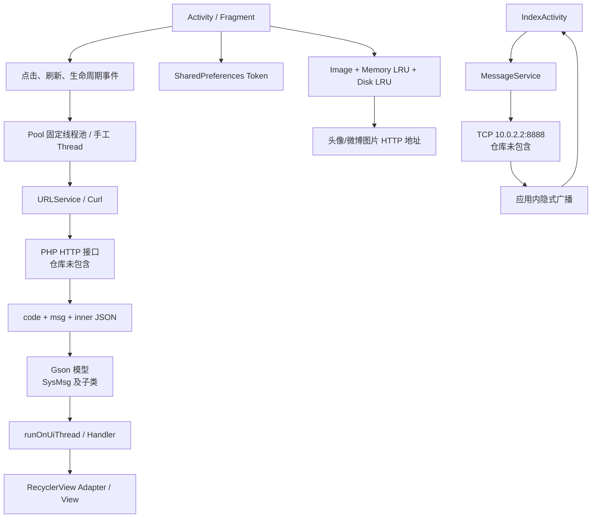
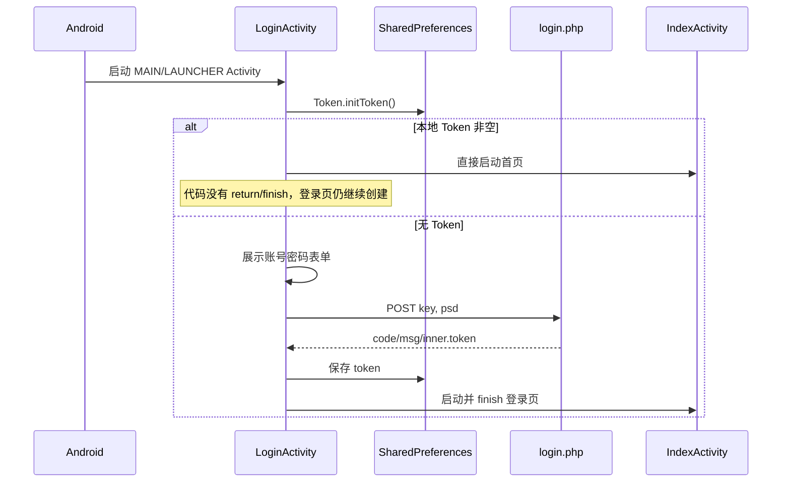

# WeiboAndroid
> 仓库：`https://github.com/winisrf/weibo-master`  
> 分支：`main`  
> 项目日期：2023  
> 文档更新日期：2026-07-22

## 1. 项目功能

这是一个原型性质的微博客户端，具备登录、时间线、话题、用户资料、关注、发微博、评论/回复/点赞、消息列表和基于长连接的消息红点等主要界面与客户端逻辑；但后端、数据库、Redis/Netty 服务均不在仓库内，而且 Android 技术栈和依赖较旧，代码中还存在数个稳定可触发的崩溃与安全问题。客户端实际提供以下功能：

1. 账号登录和本地 Token 持久化。
2. 首页时间线，可切换“最新微博”“热门微博”“我的关注”。
3. 下拉刷新与向上加载，列表只保留最多 10 条数据。
4. 微博文本中的 `#话题#`、`@用户` 和 HTTP(S) 链接识别、着色与点击跳转。
5. 多图微博展示，使用九宫格控件；发布微博时最多选择 9 张图片。
6. 微博详情、评论列表、评论回复和点赞请求。
7. 热门话题列表与话题搜索，进入指定话题的微博列表。
8. 用户主页、关注/取消关注、粉丝/关注列表和个人微博列表。
9. 当前账号资料查看、地区和签名修改、头像上传、退出登录。
10. 新粉丝、@我的、评论回复三类消息列表与角标。
11. 后台 TCP 长连接接收未读数，并通过应用内广播更新首页红点。
12. 外部链接跳转前提示，再在内置 WebView 中加载。

以下界面存在但功能未完成：

- 登录页“忘记密码”和“注册”只有静态文字，没有点击处理。
- 用户页“发私信”按钮没有点击处理，也没有私信模型或接口。
- `FollowAdapter` 和空的 `FollowModel` 没有接入实际的新粉丝列表；当前 `FollowFG` 复用了 `UserListAdapter`。
- README 明确说明没有实现转发微博。

## 2. 总体架构

项目没有采用现代分层架构或依赖注入。其真实结构更接近“Activity/Fragment 直接驱动网络和状态”的轻量 MVC：



### 2.1 客户端层次

| 层次 | 主要目录/类 | 职责 |
|---|---|---|
| 页面容器 | `LoginActivity`、`IndexActivity`、各功能 Activity | 页面生命周期、跳转、请求发起、UI 更新 |
| 首页/消息子页 | `Index/FG/*`、`Message/FG/*` | Fragment 页面、刷新和分页 |
| 列表绑定 | 各 `Adapter` | RecyclerView 行布局、点击事件、图片加载 |
| 数据模型 | `*Model`、`SysMsg`、`Comm` | 与服务端 JSON 字段对应 |
| HTTP | `URLService`、`Curl` | OkHttp 表单/上传请求及 HttpURLConnection 图片下载 |
| 并发 | `Pool`、手工 `Thread` | 网络请求和 Socket 循环 |
| 会话 | `Token` | 静态 Token + `SharedPreferences` |
| 图片 | `Image`、`DiskLRU`、`Compress` | 内存/磁盘缓存、下载、缩略图解码 |
| 富文本 | `LinkText`、`Reply` | 话题、@、链接与回复对象的可点击文本 |
| 实时消息 | `MessageService` | TCP 心跳、接收未读数、发广播 |

### 2.2 后端边界

README 声称服务端采用 PHP + MySQL，Redis 用于热门话题、Token 缓存和消息队列，Netty 提供实时提醒。但仓库中只存在 Android 客户端：

- 没有 PHP 文件、SQL、数据库迁移或数据字典。
- 没有 Netty、Jedis 或 Redis 服务端代码；它们也不在 Android 依赖中。
- 没有 Docker、部署脚本、环境变量示例或 API 文档。
- 没有测试账号和种子数据。

因此，本文能说明客户端期望的接口与字段，不能保证服务端的真实实现、鉴权规则或错误码全集。

## 3. 主执行流程

### 3.1 启动与登录



Token 保存在名为 `token` 的 `SharedPreferences` 文件中，键同样是 `token`。退出登录时清空该值并通过 `ActivityList.exit()` 结束已登记的 Activity。

### 3.2 首页与时间线

`IndexActivity` 持有三个 Fragment：

- `WeicoFragment`：时间线。
- `TitleFragment`：话题。
- `AccountFragment`：当前账号。

底部导航首次选择某页时 `add`，之后仅 `hide/show`，因此 Fragment 实例及其列表状态会保留。

时间线标题弹窗会把 `type` 切换为：

| 标题 | `type` | 请求入口 |
|---|---|---|
| 最新微博 | `new` | `new.php` |
| 热门微博 | `hot` | `hot.php` |
| 我关注的 | `care` | `care.php` |

`WeicoFragment.Refresh(flag)` 的约定是：

- `flag=1`：刷新较新的数据，基准 ID 为当前首条 ID；切换类型时重置为 0。
- `flag=0`：加载更旧的数据，基准 ID 为当前末条 ID。
- 无论方向，内存列表最多保留 `cache=10` 条；向一端添加时从另一端删除。

这是“ID 游标 + 固定窗口”，不是页码分页。后端必须按方向返回有序、去重的数据，否则客户端会重复或乱序。该约定是根据客户端代码推断，服务端实现无法确认。

### 3.3 微博展示与详情

1. `WeicoAdapter` 把 `WeicoModel.InnerBean` 绑定到 `weicoitem.xml`。
2. 头像通过 `Image` 缓存链加载；图片字段 `photo` 按逗号拆分，交给 `NineGridImageView`。
3. 正文交给 `LinkText.parse()`：
   - `#[^#]+#` 匹配话题；
   - `@[^\s@]+` 匹配用户名；
   - `https?://(/|[0-9a-zA-Z]|\.|%)+` 匹配有限形式的 URL。
4. 点击整条微博携带 `wid` 进入 `Comment`。
5. `Comment` 并行获取微博详情 `get.php` 和评论 `comment.php`。
6. 点击评论行设置 `cid/cuid`，随后 `reply.php` 提交回复；点赞调用 `praise.php`。

### 3.4 话题流程

`TitleFragment` 调用 `title.php` 获取话题列表。点击列表项传入 `id + title`；搜索提交只传 `title`，`id` 默认为 0。`Title` 页面调用 `weicotitle.php`，响应不是单纯列表，而是：

```text
TitleSearchModel
└── inner
    ├── id       后续请求使用的游标/话题 ID（代码推断）
    └── inner    WeicoModel.InnerBean 列表
```

### 3.5 用户与关注流程

- 点击微博作者、评论作者、@用户或用户列表项进入 `User`。
- `user.php` 接受 `token`、`id` 和 `name`，返回 `UserModel`。
- `UserModel.inner.flag` 控制关注按钮：代码按 `0=本人、1=未关注、2=已关注` 处理。
- 关注/取消关注请求使用 `follow.php?token=...&flag=...&id=...`。
- 粉丝和关注列表分别使用 `myfans.php`、`mycare.php`。
- “个人微博”进入 `Account`，使用 `myweico.php` 加载该用户的微博。

注意：`User.init()` 对仅传 `uid` 的常规跳转存在空指针崩溃，详见风险章节。

### 3.6 当前账号资料

`AccountFragment` 使用 Token 调用 `account.php`。页面可执行：

- 修改地区/签名：进入 `ChangeActivity`，向 `change.php` POST `token/key/tag`。
- 修改头像：`ImgSel` 选择并裁剪单图，向 `face.php` 上传。
- 查看自己的微博、粉丝、关注。
- 清 Token、启动登录页并关闭登记的 Activity。

### 3.7 消息与长连接

首页创建时启动 `MessageService`：

1. 服务连接 `10.0.2.2:8888`。
2. 写线程每 5 秒发送一行 `{"token":"...","num":0}`。
3. 读线程读取每行 JSON 为 `MessageService.Message`。
4. `num > 0` 时发送 action 为 `com.gapcoder.weico.MESSAGE` 的广播。
5. `IndexActivity.MessageReceiver` 更新首页与底栏角标。
6. 15 秒未收到数据时，守护循环关闭 Socket 并重连。

进入消息页后，`message.php` 提供三类未读数；三个 Fragment 分别访问：

- `newfans.php`：新粉丝。
- `at.php`：@我的。
- `comm.php`：评论回复。

## 4. API 与数据契约

### 4.1 统一响应结构

所有常规接口都预期返回：

```json
{
  "code": "OK",
  "msg": "",
  "inner": {}
}
```

`SysMsg` 定义 `code/msg`；具体模型继承它并增加不同类型的 `inner`。`Base.check()`、`BaseFragment.check()` 和 `BaseFG.check()` 先判断 `code == Config.SUCCESS`，成功后调用方再强制转换。

异常时 `URLService` 返回 `new SysMsg("error", exceptionText)`。这一做法避免返回 `null`，但如果调用方忘记 `check()` 而直接转成子类，会触发 `ClassCastException`。

### 4.2 接口清单

| 接口 | 方法 | 客户端参数 | 响应模型 | 调用位置 |
|---|---|---|---|---|
| `login.php` | POST form | `key`, `psd` | `LoginModel` | 登录 |
| `new.php` | GET | `flag`, `id` | `WeicoModel` | 最新时间线 |
| `hot.php` | GET | `flag`, `id` | `WeicoModel` | 热门时间线 |
| `care.php` | GET | `flag`, `id` | `WeicoModel` | 关注时间线；代码未传 Token |
| `title.php` | GET | 无 | `TitleModel` | 热门话题 |
| `weicotitle.php` | GET | `tid`, `title`, `flag`, `id` | `TitleSearchModel` | 话题微博 |
| `get.php` | GET | `wid` | `CommWeicoModel` | 微博详情 |
| `comment.php` | GET | `wid`, `flag`, `id` | `Comm` | 评论列表 |
| `reply.php` | POST form | `wid`, `token`, `hid`, `cid`, `cuid`, `text` | `SysMsg` | 评论/回复 |
| `praise.php` | POST form | `wid`, `token`, `hid` | `SysMsg` | 点赞 |
| `upload.php` | multipart POST | `token`, `text`, `image0...imageN` | `SysMsg` | 发布微博 |
| `account.php` | GET | `token` 或 `uid` | `UserModel` | 当前账号/指定用户背景 |
| `user.php` | GET | `token`, `id`, `name` | `UserModel` | 用户资料 |
| `follow.php` | GET | `token`, `flag`, `id` | `SysMsg` | 关注切换 |
| `myweico.php` | GET | `uid`, `flag`, `id` | `WeicoModel` | 用户微博 |
| `myfans.php` | GET | `uid`, `flag`, `id` | `UserListModel` | 粉丝列表 |
| `mycare.php` | GET | `uid`, `flag`, `id` | `UserListModel` | 关注列表 |
| `change.php` | POST form | `token`, `key`, `tag` | `SysMsg` | 修改资料 |
| `face.php` | multipart POST | `token`, `image0` | `SysMsg` | 修改头像 |
| `message.php` | GET | `token` | `MessageModel` | 未读统计 |
| `newfans.php` | GET | `token` | `UserListModel` | 新粉丝消息 |
| `at.php` | GET | `token`, `flag`, `id` | `AtModel` | @消息 |
| `comm.php` | GET | `token`, `flag`, `id` | `CommModel` | 评论消息 |

所有 GET 参数都直接拼接到字符串，没有显式 URL 编码。Token 也被放在 URL 中并多处写入日志。

### 4.3 模型字段

| 模型 | `inner` 主要字段 | 说明 |
|---|---|---|
| `LoginModel` | `token` | 登录凭证 |
| `WeicoModel` | 列表：`id, uid, name, face, text, time, comment, love, photo` | 微博摘要 |
| `CommWeicoModel` | 与单条微博字段基本一致 | 微博详情 |
| `TitleModel` | 列表：`id, title` | 话题 |
| `TitleSearchModel` | `id, inner<Weico>` | 话题查询包装 |
| `UserModel` | `id, name, face, sign, place, bg, fans, care, flag` | 用户资料 |
| `UserListModel` | 列表：`id, name, face` | 用户简表 |
| `MessageModel` | `id, uid, at, follow, comment` | 未读统计，`getTotal()` 求和 |
| `Comm` | `user` 映射 + `comment` 列表 | 评论页去重用户信息 |
| `Comm.CommentBean` | `id, wid, hid, uid, oid, text, time` | `oid` 在 UI 中被当作回复对象用户 ID |
| `AtModel` | `user` 映射 + `inner` 列表 | @消息及发起用户 |
| `AtModel.InnerBean` | `id, wid, hid, oid, time` | @消息条目 |
| `CommModel` | 列表：`id, wid, hid, uid, oid, text, time, face, name` | 评论消息 |
| `MessageService.Message` | `token, num` | Socket 行协议 |
| `FollowModel` | 无字段 | 空占位类，当前未使用 |

`hid`、`oid`、`cid`、`cuid` 的完整业务定义无法从客户端单独确认。上表只描述客户端如何使用它们。

## 5. 构建、配置与运行

### 5.1 仓库的实际工程根目录

克隆后的仓库多嵌套了一层：

```text
仓库根目录/
├── .idea/
└── weibo-master/        <- Gradle 工程根目录，应从这里打开/执行
    ├── settings.gradle
    ├── build.gradle
    ├── gradlew.bat
    └── app/
```

不要把最外层目录误当成 Gradle 工程根目录。

### 5.2 所需环境

根据仓库配置，最接近原项目的环境是：

- Android Studio 4.2.x 或能兼容 Android Gradle Plugin 4.2.0 的环境。
- Gradle Wrapper 6.7.1（仓库已包含 wrapper 脚本和 JAR）。
- JDK 8 或与 AGP 4.2.0 兼容的 JDK。
- Android SDK Platform 28。
- Android SDK Build Tools 28.0.0。
- Android 模拟器，API 23 至 28 更接近项目原始目标。
- 可访问 Maven Central、Google、JCenter 和 JitPack 的网络。
- 另行提供的 PHP/MySQL/Redis/Netty 后端。

现代 Android Studio/JDK 直接打开时很可能先遇到 Gradle、JCenter、旧 Support Library 或仓库协议兼容问题。若目标只是还原原项目，先使用兼容旧工程的工具链；若目标是长期维护，应单独建立升级分支迁移到 AndroidX 和新 AGP。

### 5.3 本地配置

仓库错误地提交了 `app/local.properties`，其中写死：

```properties
sdk.dir=E\:\\UserFiles\\Android\\Sdk
```

该路径只是原开发机器配置。应改为本机 Android SDK 的绝对路径；正常情况下 `local.properties` 不应进入版本控制。

服务地址集中在 `Config.java`：

```java
url   = "http://10.0.2.2/weico/";
photo = "http://10.0.2.2/weico/photo/";
face  = "http://10.0.2.2/weico/face/";
```

实时消息地址则单独硬编码在 `MessageService.java`：`10.0.2.2:8888`。

`10.0.2.2` 是 Android 官方模拟器访问宿主机环回地址的特殊映射。因此预期拓扑为：

```text
Android 模拟器
  ├── HTTP  -> 宿主机 localhost/weico/
  └── TCP   -> 宿主机 8888
```

如果使用真机，必须把 HTTP 和 Socket 主机都改成手机可访问的局域网或公网地址。只改 `Config.java` 不够，因为 Socket 地址没有复用该配置。

### 5.4 后端最低契约

仓库无法提供完整后端安装步骤。若要让客户端工作，至少需要：

1. 在 `/weico/` 下提供第 5.2 节列出的 PHP 入口。
2. 返回 UTF-8 JSON，且至少包含非空 `code` 和 `msg`。
3. 成功码必须精确为大写 `OK`。
4. 提供 `/weico/photo/` 和 `/weico/face/` 静态资源路径。
5. TCP 8888 服务接受以换行分隔的 JSON 心跳，并以同样方式返回 `token/num` JSON。
6. 提供与模型字段类型兼容的数据；代码大量使用 `int`，不接受超出 32 位范围的 ID 或 Unix 秒时间戳。

数据库表、Redis key、PHP 扩展、Netty 协议细节和初始账号均 **无法从仓库确认**。

### 5.5 构建命令

Windows 下在内层工程目录执行：

```powershell
.\gradlew.bat assembleDebug
```

单元测试与设备测试的标准命令分别为：

```powershell
.\gradlew.bat test
.\gradlew.bat connectedAndroidTest
```

现有测试只有模板断言，命令通过也不能证明业务可用。

### 5.6 当前版本可能阻碍运行的配置

- 所有业务地址均为 HTTP；Manifest 没有 Network Security Config，也没有 `usesCleartextTraffic` 配置。目标 API 28 环境可能拒绝明文流量。
- 依赖仍使用 `jcenter()`，部分旧版本可能已难以下载。
- 同时声明了 `support-v4:25.3.0` 和 `support-v4:23.2.1`，存在版本解析冲突风险。
- Android 6+ 的存储权限流程有请求码错误；Android 10+ 又涉及分区存储变化。
- Android 8+ 对后台 Service 有额外限制，当前 `startService()` + 无限后台线程方案不适合现代系统。
- 本次分析环境没有 JDK/Android SDK，未完成实际 APK 构建；仅确认 Gradle/XML/源码结构和资源 XML 语法。

## 6. 目录树

下列树省略了 50 余个由 IDE 自动生成的 `.idea/libraries/*.xml`，其余业务目录均展开：

```text
repository/
├── .idea/                         外层误提交的 IDE 工程元数据
└── weibo-master/                  实际 Gradle 工程
    ├── README.md
    ├── README_EN.md
    ├── build.gradle
    ├── settings.gradle
    ├── gradle.properties
    ├── gradlew / gradlew.bat
    ├── gradle/wrapper/
    ├── demo/                      13 张功能截图
    └── app/
        ├── build.gradle
        ├── local.properties
        ├── proguard-rules.pro
        └── src/
            ├── test/              本地模板测试
            ├── androidTest/       设备模板测试
            └── main/
                ├── AndroidManifest.xml
                ├── java/com/gapcoder/weico/
                │   ├── Config.java
                │   ├── Post.java
                │   ├── Web.java
                │   ├── Account/
                │   ├── Change/
                │   ├── Comment/
                │   ├── General/
                │   ├── Index/{Adapter,FG,Model}/
                │   ├── Login/
                │   ├── Message/{Adapter,FG,Model}/
                │   ├── MessageService/
                │   ├── Title/
                │   ├── User/
                │   ├── UserList/
                │   └── Utils/
                └── res/
                    ├── drawable/
                    ├── layout/
                    ├── menu/
                    ├── mipmap-*/
                    └── values/
```

## 8. 逐文件职责

### 8.1 根目录与构建文件

| 文件 | 职责与维护说明 |
|---|---|
| `.idea/.gitignore` | 外层 IDE 工作区忽略规则。属于误提交的工程包装层，不参与 Android 构建。 |
| `.idea/modules.xml` | 外层 IntelliJ 模块登记。 |
| `.idea/weibo-master.iml` | 外层模块描述，记录 Android API 30 Platform；与内层实际 `compileSdk 28` 不一致。 |
| `weibo-master/.gitignore` | Gradle/Android 常见忽略项；声明忽略 `/local.properties`，但实际文件位于 `app/local.properties`，没有被此规则覆盖。 |
| `README.md` | 中文简介、设计笔记、框架列表和演示图链接。部分链接指向原始 `dingdangmao123` 仓库。 |
| `README_EN.md` | 英文简介；“实时消息仍在计划中”的表述与当前已有 `MessageService` 代码不完全一致。 |
| `settings.gradle` | 仅包含 `:app` 模块。 |
| `build.gradle` | 根构建配置；AGP 4.2.0，仓库源为 Google/JCenter/Maven Central/JitPack。 |
| `gradle.properties` | Gradle daemon 最大堆 1536 MB。 |
| `gradle/wrapper/gradle-wrapper.properties` | 固定 Gradle 6.7.1。 |
| `gradle/wrapper/gradle-wrapper.jar` | Wrapper 启动 JAR。 |
| `gradlew` / `gradlew.bat` | Unix/Windows Wrapper 启动脚本。 |
| `app/build.gradle` | Android SDK、版本、Java 8、release 和全部第三方依赖。 |
| `app/local.properties` | 原机器 SDK 路径；应本地生成，不应提交。 |
| `app/proguard-rules.pro` | 基本为空；release 又关闭混淆，因此当前不生效。 |
| `app/.gitignore` | 忽略 `app/build/`。 |
| `weibo-master/.idea/*`、`app/.idea/*` | Android Studio 工程、编译器和依赖缓存元数据。它们不是业务源文件，尤其 `app/.idea/libraries/*.xml` 可由 Gradle 重新生成，建议后续清理出版本控制。 |
| `demo/1.png` 至 `demo/13.png` | README 所用的应用演示截图；不打包进 APK。 |

### 8.2 应用入口与通用层

| 文件 | 职责 |
|---|---|
| `AndroidManifest.xml` | 声明网络/存储权限、登录入口、全部 Activity、图片选择 Activity 和消息 Service。 |
| `Config.java` | HTTP 基础地址、图片地址和成功码常量。Socket 地址未纳入此处。 |
| `General/Base.java` | Activity 模板：布局钩子、ButterKnife、Toolbar、返回键、错误检查、UI 线程和刷新结束处理。 |
| `General/SysMsg.java` | 所有 HTTP 响应的 `code/msg` 基类。 |
| `General/URLService.java` | OkHttp GET、表单 POST、multipart 上传及 Gson 反序列化。每次请求都会新建客户端。 |
| `General/UserModel.java` | 用户资料响应模型。 |
| `General/MessageModel.java` | 三类消息未读数及总数计算。 |
| `Utils/Token.java` | 静态 Token 与 `SharedPreferences` 的读写/清除。源码中有一个硬编码初值，但启动会由本地值覆盖。 |
| `Utils/Pool.java` | 按 CPU 核心数创建的全局固定线程池。没有关闭或任务取消机制。 |
| `Utils/ActivityList.java` | 静态保存 Activity，供退出登录时批量结束。 |
| `Utils/T.java` | 自定义居中 Toast，提供长/短时长两个方法。 |
| `Utils/Time.java` | Unix 秒时间戳转“刚刚/分钟前/小时前/天前/年前”。年份公式存在错误。 |
| `Utils/Curl.java` | 基于 `HttpURLConnection` 的文本和图片 GET；与 OkHttp 网络层并存。 |
| `Utils/Compress.java` | 使用 `inSampleSize` 按目标宽高缩小图片解码。 |
| `Utils/DiskLRU.java` | 初始化 100 MB DiskLruCache，并用 MD5 生成缓存键。 |
| `Utils/Image.java` | 1/8 最大堆内存 LRU + 磁盘 LRU + 双线程下载池的图片加载器，通过 ImageView tag 防止列表错图。 |
| `Utils/LinkText.java` | 正则识别话题、@和 URL，生成可点击 Span 并跳转到对应页面。 |

### 8.3 登录与首页

| 文件 | 职责 |
|---|---|
| `Login/LoginActivity.java` | 初始化 Token、自动进入首页、提交登录表单并保存 Token。 |
| `Login/LoginModel.java` | 登录响应中的 `inner.token`。 |
| `Index/IndexActivity.java` | 三个主 Fragment 的导航与保活、消息 Service 启停、广播接收、底栏角标。 |
| `Index/FG/BaseFragment.java` | 首页 Fragment 模板：ButterKnife、Toolbar、发布菜单、错误检查和 UI 线程辅助。 |
| `Index/FG/WeicoFragment.java` | 三种时间线切换、刷新/加载、10 条滑动窗口和消息入口。 |
| `Index/FG/TitleFragment.java` | 热门话题列表、刷新和搜索提交。 |
| `Index/FG/AccountFragment.java` | 当前账号资料、头像选择上传、资料编辑跳转、列表跳转和退出登录。 |
| `Index/Model/WeicoModel.java` | 微博列表模型。 |
| `Index/Model/TitleModel.java` | 话题列表模型。内部类名 `inner` 未遵循 Java 命名规范。 |
| `Index/Adapter/WeicoAdapter.java` | 微博卡片绑定、详情/作者跳转、富文本、头像和九宫格图片。 |
| `Index/Adapter/TitleAdapter.java` | 话题行绑定和话题页跳转。 |
| `Index/Adapter/GridAdapter.java` | 九宫格图片 URL 拼接与缩略图加载。 |

### 8.4 发布、详情与评论

| 文件 | 职责 |
|---|---|
| `Post.java` | 200 字计数、多图选择/删除、最多 9 图校验、权限申请和 multipart 发布。 |
| `Comment/Comment.java` | 微博详情、评论分页、回复目标状态、发送评论/回复和点赞。 |
| `Comment/CommentAdapter.java` | 评论行、回复对象展示、作者跳转和头像加载。 |
| `Comment/Comm.java` | 评论列表模型，拆成用户映射和评论列表。 |
| `Comment/CommWeicoModel.java` | 微博详情模型。与 `WeicoModel.InnerBean` 高度重复。 |
| `Comment/Reply.java` | 生成“回复用户名”可点击 Span。 |

### 8.5 话题、用户与资料

| 文件 | 职责 |
|---|---|
| `Title/Title.java` | 指定话题的微博列表和游标加载。初始化时重复触发刷新。 |
| `Title/TitleSearchModel.java` | 话题查询的嵌套响应模型。 |
| `User/User.java` | 他人资料、关注状态切换、粉丝/关注/微博跳转。私信按钮未实现。 |
| `Account/Account.java` | 指定用户的背景图和微博列表。下载头像结果但不显示。 |
| `UserList/UserListActivity.java` | 粉丝/关注列表及 ID 游标加载。 |
| `UserList/UserListAdapter.java` | 用户简表绑定和用户页跳转；头像 tag 与 URL 使用不一致。 |
| `UserList/UserListModel.java` | 用户简表响应模型。 |
| `Change/ChangeActivity.java` | 通用单字段资料编辑页，保存 `place` 或 `sign` 并回传结果。 |
| `Web.java` | 外链确认与 WebView 加载。未配置 WebViewClient、安全策略或页面状态。 |

### 8.6 消息系统

| 文件 | 职责 |
|---|---|
| `Message/Message.java` | 消息中心容器、三类 Fragment 切换和未读角标。 |
| `Message/FG/BaseFG.java` | 消息 Fragment 的绑定、错误检查和刷新收尾模板。 |
| `Message/FG/FollowFG.java` | 新粉丝列表；整表刷新，不支持加载更多。 |
| `Message/FG/AtFG.java` | @消息列表和游标加载；缺少响应成功检查。 |
| `Message/FG/CommFG.java` | 评论回复消息列表和游标加载。 |
| `Message/Adapter/AtAdapter.java` | @消息行及微博详情跳转。 |
| `Message/Adapter/CommAdapter.java` | 评论消息行及微博详情跳转。 |
| `Message/Adapter/FollowAdapter.java` | 未完成且未使用的关注消息适配器。 |
| `Message/Model/AtModel.java` | @消息列表 + 用户映射模型。 |
| `Message/Model/CommModel.java` | 评论消息模型。 |
| `Message/Model/FollowModel.java` | 空占位类。 |
| `MessageService/MessageService.java` | TCP 心跳、接收、超时重连和广播。线程与资源生命周期不完整。 |
| `MessageService/Message.java` | TCP 行 JSON 的 `token/num` 模型。 |

### 8.7 Layout 资源

| 文件 | 对应界面/作用 |
|---|---|
| `layout/activity_login.xml` | 登录表单；含未接线的忘记密码、注册文本。 |
| `layout/activity_index.xml` | 主 Fragment 容器和三项底部导航。 |
| `layout/fragment_weico_fg.xml` | 首页 Toolbar、消息入口、时间线和刷新容器。 |
| `layout/fragment_title_fg.xml` | 话题 SearchView 和列表。 |
| `layout/fragment_account_fg.xml` | 当前账号资料、头像、关注/粉丝、编辑、个人微博和退出。 |
| `layout/activity_post.xml` | 发布文本、图片 Grid、选择按钮和字数。 |
| `layout/activity_comment.xml` | 微博详情、九宫格、点赞、评论列表和输入栏。 |
| `layout/activity_title.xml` | 话题微博列表。 |
| `layout/activity_user.xml` | 他人用户资料、关注和私信按钮。 |
| `layout/activity_account.xml` | 用户背景图和个人微博列表。 |
| `layout/activity_user_list.xml` | 粉丝/关注列表。 |
| `layout/activity_change.xml` | 单字段资料编辑。 |
| `layout/activity_message.xml` | 消息中心 Toolbar 和 Fragment 容器。 |
| `layout/fragment_follow_fg.xml` | 新粉丝消息列表。 |
| `layout/fragment_at_fg.xml` | @消息列表。 |
| `layout/fragment_comm_fg.xml` | 评论消息列表。 |
| `layout/activity_web.xml` | 外链提示、确认按钮和 WebView；控件叠放关系可疑。 |
| `layout/content_web.xml` | Android Studio 模板残留，`activity_web.xml` 中的 include 已注释，当前未使用。 |
| `layout/weicoitem.xml` | 微博卡片：头像、作者、时间、正文、九宫格、评论/赞。 |
| `layout/commentitem.xml` | 评论行。 |
| `layout/commitem.xml` | 评论消息行。 |
| `layout/atitem.xml` | @消息行。 |
| `layout/userlistitem.xml` | 用户简表行。 |
| `layout/titleitem.xml` | 话题行。 |
| `layout/griditem.xml` | 发布页已选图片单元格。 |
| `layout/popmenu.xml` | 时间线类型弹窗。 |
| `layout/messagemenu.xml` | 消息类型弹窗。 |
| `layout/toast.xml` | 自定义 Toast 内容。 |

### 8.8 Menu、values、drawable 与图标

| 文件/文件组 | 作用 |
|---|---|
| `menu/tabs.xml` | 首页、话题、我三个底部菜单项。 |
| `menu/toolbar.xml` | 相机图标“发布”动作。 |
| `menu/ok.xml` | 文本“完成”动作，用于发布和资料编辑。 |
| `menu/search.xml` | 话题搜索菜单；当前 `TitleFragment` 直接在布局中使用 SearchView，此菜单未引用。 |
| `values/strings.xml` | `app_name=weico` 和模板字符串。大部分中文仍硬编码在布局/Java 中。 |
| `values/colors.xml` | 主色、灰色、文字色、链接高亮等。 |
| `values/styles.xml` | 无 ActionBar 应用主题、Toolbar 与弹窗覆盖主题。 |
| `values/dimens.xml` | 仅有未见使用的 `fab_margin`。 |
| `drawable/bg.xml` | 选择器/形状背景；需结合引用确认状态效果。 |
| `drawable/btn.xml` | 普通描边按钮背景。 |
| `drawable/edit.xml` | 编辑框背景状态。 |
| `drawable/emoji.xml` | 表情相关背景；代码和布局未见使用。 |
| `drawable/loginbtn.xml` | 登录按钮背景。 |
| `drawable/toast.xml` | Toast 背景。 |
| `drawable/white.xml` | 登录输入框白色背景。 |
| `drawable/ic_search_black_24dp.xml` | 搜索矢量图；未见业务引用。 |
| `drawable/face.jpg` | 列表头像占位图。 |
| `drawable/publish_face_n3x.png` | 发布相关图片；未见业务引用。 |
| `mipmap-*/ic_launcher*.png` | 多密度普通/圆形应用图标。 |
| `mipmap-xxhdpi/ic_home.png` | 首页底栏图标。 |
| `mipmap-xxhdpi/ic_card_membership.png` | 话题底栏图标。 |
| `mipmap-xxhdpi/ic_supervisor_account.png` | 账号底栏图标。 |
| `mipmap-xxhdpi/ic_camera_alt.png` | 发布动作图标。 |
| `mipmap-xxhdpi/ic_keyboard_arrow_right.png` | 资料页右箭头。 |
| `mipmap-xxhdpi/ic_search.png` | 搜索菜单图标。 |
| `mipmap-xxhdpi/ic_favorite.png`、`ic_mail_outline.png`、`ic_message.png`、`ic_photo.png`、`ic_refresh.png` | 当前代码/布局未见引用的备用图标。 |

### 8.9 测试文件

| 文件 | 作用 |
|---|---|
| `src/test/.../ExampleUnitTest.java` | 仅断言 `2 + 2 == 4`，不覆盖业务。 |
| `src/androidTest/.../ExampleInstrumentedTest.java` | 仅检查应用包名。 |

## 9. 关键代码解读

### 9.1 模板方法式 Activity 初始化

`Base.onCreate()` 固定执行：

```text
ActivityList.add
-> 子类 setContentView()
-> ButterKnife.bind
-> 设置 Toolbar 与返回按钮
-> 子类 init()
```

子类通过重写空方法完成页面差异。这种方式简单，但编译器无法保证子类提供布局或布局中一定存在 `toolbar`。新增继承 `Base` 的页面时，必须同时提供：

- `setContentView()`；
- 带 `@+id/toolbar` 的布局；
- `init()` 中的事件和数据初始化；
- Manifest Activity 声明。

`BaseFragment` 和 `BaseFG` 采用类似模板。两套 Fragment 基类有重复代码，且访问 `getActivity()` 时未检查 Fragment 是否已分离。

### 9.2 `SysMsg` 继承规避 Gson 泛型

代码没有统一的 `ApiResponse<T>`，而是让 `WeicoModel`、`UserModel` 等继承 `SysMsg`。`URLService` 的返回类型仍是 `SysMsg`：

```text
请求 -> Gson 按传入 Class 反序列化 -> 作为 SysMsg 返回
     -> check(code) -> 强制转换到具体模型 -> 读取 inner
```

优点是实现简单；缺点是大量强制转换、忘记 `check()` 时崩溃、无法表达 `inner` 的静态类型。新增接口应至少遵守现有 `code/msg/inner` 协议；长期重构可引入统一泛型响应和 Repository 层。

### 9.3 `URLService` 的三种请求

- `get(url, class)`：基础地址 + 相对 URL。
- `post(url, map, class)`：`application/x-www-form-urlencoded`。
- `upload(url, map, files, class)`：multipart，文件字段按 `image0`、`image1` 递增。

三个方法都同步阻塞，因此调用者必须放到 `Pool`。当前每次请求都新建 `OkHttpClient`，没有复用连接池、统一超时、拦截器、HTTP 状态检查或响应体安全关闭。维护时优先改成一个应用级客户端，并把 URL 参数交给 `HttpUrl` 构造器编码。

### 9.4 时间线的双向固定窗口

刷新时新数据插到头部，超出 10 条从尾部删除；加载更多时旧数据追加到尾部，超出 10 条从头部删除。它节省内存，但会导致用户向旧数据方向翻页后，刚看过的新数据被丢弃；再次刷新时基准 ID 又随当前窗口变化。

如果要添加真正的无限列表，应把“游标”“加载方向”“去重”“是否还有更多”抽成独立分页状态，避免在多个 Activity/Fragment 中复制当前逻辑。

### 9.5 富文本跳转

`LinkText` 对匹配区间同时添加颜色 Span 和 ClickableSpan：

- `@name` -> `User`，传 `name`；
- `#title#` -> `Title`，传 `title`；
- HTTP(S) -> `Web`，传 `url`。

调用方还必须给 TextView 设置 `LinkMovementMethod`，否则 Span 不可点击。当前 URL 正则不支持常见的查询参数、连字符、下划线、端口等字符，新增链接功能时应替换为 Android `Patterns.WEB_URL` 或可靠解析器，并明确正文转义规则。

### 9.6 图片缓存链

`Image.down()` 的目标流程为：

```text
内存 LRU 命中 -> 显示
否则磁盘 LRU 命中 -> 采样解码 -> 写内存 -> 显示
否则网络下载到 DiskLruCache -> 再次读取并显示
```

通过 `ImageView.setTag(url)` 判断异步结果是否仍属于当前 RecyclerView 行，避免复用导致错图。此机制要求“tag 值”和“传给 Image.down 的 URL”完全一致；`UserListAdapter` 违反了这一条件，是头像不显示的重要原因。

### 9.7 评论数据去重结构

`Comm.inner` 把数据拆成：

- `user: Map<uid, UserBean>`；
- `comment: List<CommentBean>`。

Adapter 通过评论的 `uid/oid` 查用户映射，避免每条评论重复携带用户名和头像。加载更多时，新响应的用户映射先 `putAll` 到全局映射，再合并评论列表。后端必须保证评论中出现的每个用户 ID 都存在于映射中，否则 Adapter 会空指针。

### 9.8 Socket 通知机制

`MessageService` 启动两个数据线程和一个监视线程。协议虽然简单，但共享 Socket 没有锁，重连会再次创建读写线程，旧线程也没有可靠停止。新增通知功能前，应先把连接封装为单一状态机，明确 connect/authenticate/heartbeat/reconnect/close，并在 `onDestroy()` 中关闭 Socket 和线程。

## 10. 第三方依赖

| 依赖 | 版本 | 实际用途/状态 |
|---|---:|---|
| Android Support Design/AppCompat/Support v4/CardView | 25.3.0 为主 | 页面、Fragment、RecyclerView 间接依赖、Toolbar、BottomNavigation、CardView |
| ConstraintLayout | 1.0.2 | 多个 Activity/Fragment 根布局 |
| ButterKnife | 8.4.0 | `@BindView`、`@OnClick`、`@OnTextChanged` |
| OkHttp | 3.9.1 | `URLService` HTTP 请求 |
| Gson | 2.8.2 | HTTP 与 Socket JSON |
| SmartRefreshLayout/Header | 1.0.4-7 | 下拉刷新/加载更多 |
| EasyPopup | 1.0.2 | 时间线与消息类型弹窗 |
| BadgeView | 1.1.3 | 未读角标 |
| NineGridImageView | 1.1.1 | 微博多图九宫格 |
| Glide | 3.7.0 | 只用于头像选择器内的本地预览 |
| DiskLruCache | 1.2.0 | 自定义图片磁盘缓存 |
| MultiImageSelector | 1.2 | 发布微博选择多图 |
| ImgSel | 2.0.2 | 头像单选与裁剪 |
| BottomBar | 2.3.1 | **未发现使用**；实际用系统 `BottomNavigationView` |
| CustomPopwindow | 2.1.1 | **未发现使用**；实际用 EasyPopup |
| RickText | 2.1.5 | **未发现使用**；富文本为自研 `LinkText` |
| BubbleView | 1.0.2 | **未发现使用** |
| RxPermissions2 | 0.9.5 | **未发现使用**；权限为手写回调 |

此外，`support-v4` 同时声明 25.3.0 和 23.2.1，应删除较旧的重复声明并统一 Support Library 版本。长期维护建议迁移 AndroidX，但应作为独立升级任务，不宜与业务修复混在一次变更中。

## 11. 如何修改或新增功能

### 11.1 修改服务地址

同时修改：

1. `Config.java` 的 `url/photo/face`。
2. `MessageService.java` 的 Socket 主机和端口。
3. 若继续使用 HTTP，在 Manifest/Network Security Config 中明确开发环境明文策略；生产环境应使用 HTTPS/TLS。

推荐将地址拆成 `debug/release` BuildConfig 字段，避免再散落硬编码。

### 11.2 新增一个普通页面

1. 新建继承 `Base` 的 Activity。
2. 新建对应 `activity_*.xml`，必须包含 `toolbar`，除非同时改造 `Base`。
3. 重写 `setContentView()` 和 `init()`。
4. 在 `AndroidManifest.xml` 注册。
5. 在来源页面用 Intent 传入明确键名，并在目标页校验缺失/错误参数。
6. 添加正常、缺参和网络失败测试。

### 11.3 新增一个接口

按现有风格最小改动需要：

1. 与服务端确认 `code/msg/inner` JSON。
2. 新建继承 `SysMsg` 的模型。
3. 在后台线程调用 `URLService`。
4. 调用 `check()` 后再转换模型。
5. 只在主线程更新 View。
6. 处理 Activity/Fragment 已销毁、空 `inner`、空列表、超时和重复请求。

更稳妥的中期方案是在 UI 与 `URLService` 之间增加 Repository，集中 Token、URL 编码、错误映射、线程和缓存。

### 11.4 新增时间线类型

修改入口集中在 `WeicoFragment`：

- `popmenu.xml` 增加选项；
- `CreateView()` 绑定选项并设置新的 `type/current/title/reset`；
- 后端增加 `{type}.php` 或改成统一 feed 接口；
- 继续返回 `WeicoModel`；
- 对新类型增加切换、刷新、加载更多和空结果测试。

当前 `current` 是手工整数，新增类型时容易冲突，建议改成 enum。

### 11.5 修改微博卡片

- 数据字段：`WeicoModel.InnerBean` 和 `CommWeicoModel.InnerBean`。
- 行布局：`weicoitem.xml`。
- 绑定：`WeicoAdapter.onBindViewHolder()`。
- 详情布局与绑定：`activity_comment.xml`、`Comment.getWeico()`。
- 若字段也出现在评论消息，检查 `CommModel`。

同一微博结构目前复制在两个模型中；新增字段时必须同步，否则列表与详情会不一致。

### 11.6 新增消息类型

需要同时修改 HTTP 消息中心与实时红点：

1. `MessageModel` 增加计数字段和 `getTotal()`。
2. 新建消息 Model、Fragment、Adapter 和布局。
3. `Message` 的 `map/flag/tv/msg` 增加类型与弹窗选项。
4. 后端 HTTP 增加列表接口。
5. 确认 Socket `num` 是总数还是分类数；当前行协议只有总数，无法表达分类。

### 11.7 实现私信、注册或找回密码

这些不是简单补一个点击事件：仓库没有模型、接口、会话、列表或服务端契约。应先定义：

- 服务端接口和鉴权；
- 数据模型和分页；
- 私信实时协议及已读语义；
- 注册验证方式；
- 密码找回的安全流程。

在这些契约缺失时直接写 UI 会继续产生“看起来可点但没有完整功能”的页面。

## 12. 已知风险与限制

### 12.1 P0：优先修复的崩溃/主流程问题

1. **用户详情常规入口会空指针**：`User.init()` 先把 `n` 赋为 `getStringExtra("name")`，随后调用 `n.length()`。多数入口只传 `uid`，因此 `n` 为 `null`。应使用空串默认值或分别判断。
2. **空列表加载更多会越界**：`Account`、`UserListActivity`、`Comment`、`AtFG`、`CommFG` 在 `flag=0` 时直接访问 `size-1`。首次请求尚未完成或列表为空时触发加载更多即可崩溃。
3. **`AtFG` 忘记检查响应**：网络异常时 `URLService` 返回纯 `SysMsg`，代码直接强转 `AtModel`，会 `ClassCastException`。
4. **`AccountFragment.Refresh()` 忘记检查响应**：失败响应仍被强转 `UserModel`，随后读取 `inner`。
5. **头像选择结果先解引用后判空**：`AccountFragment.onActivityResult()` 在检查 `data != null` 之前执行 `data.getStringExtra()`。
6. **发布页权限请求码不一致**：申请存储权限使用请求码 `1`，回调却只处理 `IMAGE=0`，授权后不会自动打开选择器。

### 12.2 P1：安全、兼容性与资源生命周期

1. **HTTP 明文传输**：登录密码、Token、正文和图片均可能通过 HTTP；Socket 也没有 TLS。
2. **Token 出现在 GET URL 和日志**：代理、服务器日志和 Logcat 都可能记录凭证。
3. **硬编码 Token 初值**：`Token.java` 含看似真实的 40 位 Token。即使启动时通常会覆盖，也应撤销服务端凭证并从源码删除。
4. **Service 对外导出**：Manifest 将 `MessageService` 设为 `android:exported="true"` 且无权限保护，其他应用可启动它。
5. **Socket 线程泄漏/竞态**：Service 没有 `onDestroy()` 清理；每次启动和重连都可能增加线程，读写线程共享可变 Socket。
6. **后台运行不符合现代 Android**：`startService()`、`START_STICKY` 和无限后台线程在 Android 8+ 受限。
7. **无生命周期取消**：网络任务完成时 Activity/Fragment 可能已销毁，`getActivity()` 或 View 更新可能崩溃/泄漏。
8. **任意 URL WebView**：正文 URL 可进入 WebView，缺少域名限制、WebViewClient、安全浏览和异常处理。
9. **旧存储权限方案**：依赖已废弃的外部存储权限，无法覆盖现代分区存储和媒体权限。
10. **无证书/主机校验策略说明**：生产环境网络安全方案缺失。

### 12.3 P1：数据与界面正确性

1. **用户列表头像首次加载失败**：Adapter 给 ImageView 的 tag 是原始 `face`，但下载 URL 是 `Config.face + face`；异步回调比较不相等，不设置图片。
2. **头像 URL 语义不一致**：模型注释示例把 `face` 写成完整 URL，多个 Adapter 又把它当文件名拼接，`Account` 则直接下载 `m.getFace()`。必须统一服务端契约。
3. **年份格式公式错误**：`Time.format()` 返回 `cur / 86400 * 365 + "年前"`，实际应先除以一年秒数。
4. **当前用户关注按钮文案错误**：`User.Refresh()` 的 `case 0` 缺少 `break`，先设“我”又落入 `case 1` 改成“加为关注”。
5. **登录自动跳转未结束当前页**：本地 Token 非空时启动首页，但不 `finish()` 或 `return`，返回栈和重复页面可能异常。
6. **话题页发起重复请求**：`Title.init()` 同时调用 `rf.autoRefresh()` 和 `Refresh(1)`。
7. **点赞成功后不更新数字/状态**：只能显示 Toast，用户可能重复点赞。
8. **发送评论后不刷新列表**：新评论不会立即出现在当前界面。
9. **私信、注册、找回密码为假入口**：用户能看到控件，但没有事件和业务链路。
10. **WebView 与提示布局叠放**：`activity_web.xml` 中 WebView 是后声明的同级控件，可能覆盖确认区域；同时高度为 `wrap_content`，加载后布局不可预测。

### 12.4 P2：可维护性与性能

1. 每次 HTTP 请求创建新的 `OkHttpClient`，无法充分复用连接池。
2. OkHttp 与 HttpURLConnection 两套网络栈并存，错误、超时和缓存策略不一致。
3. URL 参数直接字符串拼接，没有可靠编码。
4. 大量中文和颜色硬编码在 Java/XML，国际化和主题修改困难。
5. 分页逻辑复制在至少六个页面，且边界处理不一致。
6. 模型重复：`WeicoModel.InnerBean` 与 `CommWeicoModel.InnerBean` 基本相同。
7. `BaseFragment` 与 `BaseFG` 重复，错误处理也有多个版本。
8. `FollowAdapter`、`FollowModel`、`content_web.xml`、若干图标和依赖是死代码/未使用资源。
9. `.idea`、依赖缓存描述和机器专用 `local.properties` 被提交，仓库噪声很高。
10. release 关闭混淆，没有签名、CI、静态检查或发布流程。
11. 没有数据库/API schema 的版本控制，客户端与后端容易静默漂移。
12. `int` 时间戳存在 2038 问题，ID 也可能溢出；应评估改为 `long`。

## 13. 调试与维护指南

### 13.1 推荐的恢复顺序

1. 先建立可重复构建：清理机器路径，固定 JDK/SDK，恢复依赖下载。
2. 让后端返回一个最小健康接口，并确认模拟器能访问 `10.0.2.2`。
3. 修复 P0 崩溃和权限请求码。
4. 统一 `face/photo` 字段到底是文件名还是完整 URL。
5. 打通登录 -> 首页 -> 详情 -> 评论的最短链路。
6. 再启用头像上传和多图发布。
7. 最后启用 Socket 服务；实时消息不是其余 HTTP 功能的前置条件。

### 13.2 常见问题定位

| 现象 | 优先检查 |
|---|---|
| 所有接口连接失败 | `Config.url`、宿主机 PHP、模拟器是否使用 `10.0.2.2`、明文 HTTP 策略 |
| 真机无法连接 | 不能使用 `10.0.2.2`；改为可路由地址并开放防火墙端口 |
| 登录成功但返回后仍见登录页 | `LoginActivity` 自动跳转路径没有 finish |
| 点击用户立即崩溃 | `User.init()` 的 `name` 空值 |
| 头像不显示 | 服务端字段是否完整 URL、Adapter tag 是否与加载 URL 一致、磁盘缓存目录 |
| 下拉刷新一直转 | 是否走到 `SmartRefresh()`；异常分支是否调用了 `check()` |
| 加载更多崩溃 | 数据列表为空时访问最后一项 |
| 发布选图授权后无反应 | 权限请求码 1 与 `IMAGE=0` 不一致 |
| 首页无消息红点 | TCP 8888、Token、换行 JSON、广播接收和 `last` 更新时间 |
| 消息服务耗电/线程增长 | 重复 `onStartCommand()`、重连产生的新线程、Socket 未关闭 |
| Gradle 无法解析依赖 | JCenter/JitPack、旧依赖版本、重复 Support Library |

### 13.3 日志策略

当前大量日志统一使用 `tag`，并会打印完整 URL、JSON 和 Socket 行。维护时应：

- 为网络、图片、分页、Socket 使用独立 tag；
- release 禁止输出 Token、密码、完整用户正文和响应；
- 给一次请求分配 request ID，记录方法、路径、耗时、状态，不记录敏感参数；
- 对重连记录状态转换，避免只看到多个“start/exit”。

### 13.4 建议补充的测试

最低测试集：

- `Time.format()` 各时间边界与年份公式。
- `LinkText` 对中文、连续 @、查询参数 URL、恶意/异常输入的匹配。
- `SysMsg` 成功、业务失败、无效 JSON、空字段。
- 双向分页：空列表、单条、重复结果、切换 feed、无更多数据。
- `User` 只传 uid、只传 name、两者都缺失。
- 发布页权限允许/拒绝、0/1/9/10 张图、200/201 字。
- 评论页首次加载失败、空评论加载更多、回复目标复位。
- Socket 断开、超时、重复启动、Service 销毁和进程重建。
- 一个 MockWebServer 驱动的登录到时间线集成测试。

## 14. 建议的重构路线

### 阶段 A：先恢复正确性

- 修复第 12.1 节全部问题。
- 清理测试 Token 和敏感日志。
- 统一头像/图片 URL 契约。
- 为列表增加空态、错误态和“无更多”状态。
- 给网络请求设置超时、状态码检查和响应体关闭。

### 阶段 B：建立可维护边界

- 单例 OkHttpClient；取消 `Curl` 文本请求。
- Repository 统一接口、Token、错误和线程。
- 抽取通用游标分页器。
- 合并重复模型和 Fragment 基类。
- 配置分环境地址，不再硬编码。
- 用明确 DTO 文档或 JSON Schema 固化客户端/服务端契约。

### 阶段 C：平台升级

- Support Library -> AndroidX。
- 更新 AGP、Gradle、compile/target SDK。
- ButterKnife -> ViewBinding。
- 旧图片选择器 -> Android Photo Picker/Activity Result API。
- 后台 Socket -> 受控前台服务、WebSocket 或服务端推送；按产品需求选择。
- HTTP -> HTTPS，Token -> 更安全的存储与刷新机制。

### 阶段 D：工程质量

- 增加 CI：编译、单测、Lint、依赖审计。
- 增加 MockWebServer 集成测试和关键 UI 测试。
- 清理 IDE 文件、死代码、未使用资源和依赖。
- 增加后端 API/数据库/部署文档，版本化接口变更。

## 16. 接手前确认

仓库无法回答以下问题：

1. PHP、SQL、Redis 和 Netty 服务端代码在哪里？对应版本是什么？
2. `code` 除 `OK/error` 外有哪些值？Token 失效如何表示？
3. `face/photo` 字段是文件名还是完整 URL？
4. `flag/id` 分页的精确排序和去重规则是什么？
5. `hid/oid/cid/cuid` 的数据定义与外键关系是什么？
6. `follow.flag` 的 0/1/2 语义是否与客户端推断一致？
7. Socket `num` 是新增数、总未读数还是变化量？何时清零？
8. 是否有可撤销的测试 Token、测试账号和脱敏种子数据？
9. 是否允许重新设计协议并迁移 AndroidX，还是必须保持旧后端兼容？
10. 项目采用什么许可证？仓库目前没有 LICENSE 文件。

## 17. 速查表

| 要改的内容 | 首要文件 |
|---|---|
| API 主机 | `Config.java`、`MessageService.java` |
| 登录 | `LoginActivity.java`、`LoginModel.java`、`activity_login.xml` |
| 首页 feed | `WeicoFragment.java`、`WeicoModel.java`、`WeicoAdapter.java` |
| 微博卡片 | `weicoitem.xml`、`WeicoAdapter.java` |
| 发布 | `Post.java`、`activity_post.xml`、`upload.php` 契约 |
| 详情/评论/点赞 | `Comment.java`、`Comm*.java`、`CommentAdapter.java` |
| 话题 | `TitleFragment.java`、`Title.java`、`Title*Model.java` |
| 用户资料 | `User.java`、`UserModel.java`、`activity_user.xml` |
| 当前账号 | `AccountFragment.java`、`ChangeActivity.java` |
| 粉丝/关注 | `UserList*`、`follow.php` 契约 |
| 消息中心 | `Message.java`、`Message/FG/*`、`Message/Model/*` |
| 实时红点 | `MessageService.java`、`IndexActivity.java` |
| 图片性能 | `Image.java`、`DiskLRU.java`、`Compress.java` |
| @/#/URL | `LinkText.java`、`Reply.java` |
| 主题和颜色 | `values/styles.xml`、`values/colors.xml` |

---

